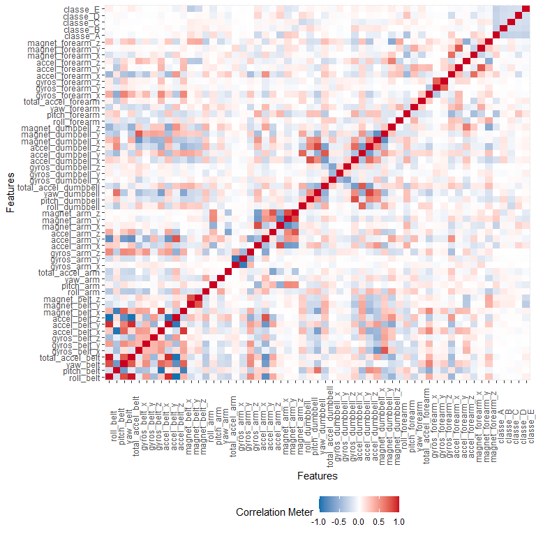
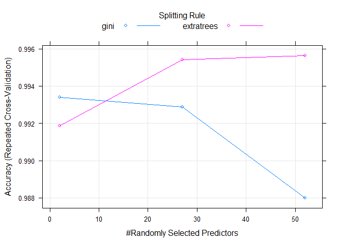
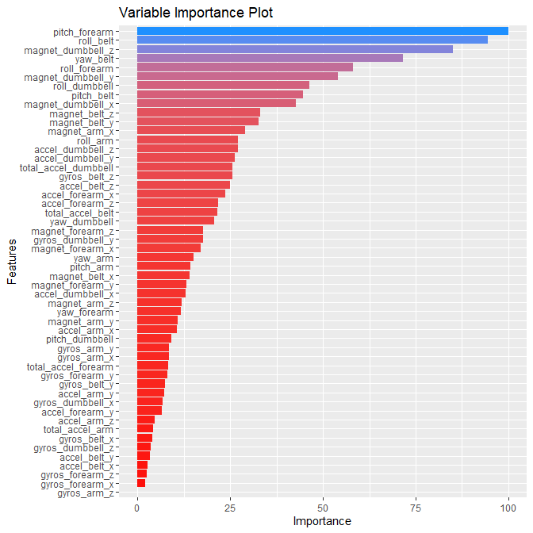

<hr>
<!-- defining writing style -->
<style>
    body {
        text-align: justify;
    }
</style>

## 1. Executive Summary  

This study includes analysis of data generated by wearable accessories' sensors while performing exercise to identify the quality of exercise being performed. The exercise that was monitored is lifting dumbbells. Several participants volunteered for this study and they were instructed and supervised to perform the exercise in five different ways: one according to the standard practice, which is the correct way of performing that exercise, and four other ways which are not according to the standard and are flawed intentionally. The aim here is to classify the quality of the exercise using the data by applying machine learning algorithms, so that these models can then be deployed in wearable devices to help people identify whether they are doing the exercise correctly or not. The model built here is successful in identifying the quality with upto 99% accuracy.

## 2. Investigation  

This section contains the study elements and details the investigation carried out for model building and prediction.  

### 2.1 Problem Statement  
As stated in the requirements in Coursera's project board: "The goal of your project is to predict the manner in which they did the exercise. This is the "classe" variable in the training set. You may use any of the other variables to predict with. You should create a report describing how you built your model, how you used cross validation, what you think the expected out of sample error is, and why you made the choices you did. You will also use your prediction model to predict 20 different test cases."  

Questions needed to be answered:  
1. How you built your model?  
2. How you used cross validation?  
3. What you think the expected out of sample error is?  
4. Why you made the choices you did?  

### 2.2 Exploratory Data Analysis  

Loading the necessary libraries and data.  

```r
# loading necessary libraries
library(dplyr)
library(caret)
library(DataExplorer)
library(ggplot2)
library(data.table)

# downloading datasets, if not downloaded already
if (!file.exists("./pml-training.csv")) {
    download.file(url = "https://d396qusza40orc.cloudfront.net/predmachlearn/pml-training.csv", destfile = "./pml-training.csv", method = "curl")
}
if (!file.exists("./pml-testing.csv")) {
    download.file(url = "https://d396qusza40orc.cloudfront.net/predmachlearn/pml-testing.csv", destfile = "./pml-testing.csv", method = "curl")
}
```
  
Checking and removing NAs.  

```r
pml <- read.csv("./pml-training.csv", na.strings = c("NA", "", " ", "#DIV/0!"))

# removing columns that contained just NAs 
nas <- sapply(pml, function(x) sum(is.na(x)))
summary(nas[nas > 0])
```

```
##    Min. 1st Qu.  Median    Mean 3rd Qu.    Max. 
##   19216   19216   19216   19251   19225   19622
```

```r
nacols <- which(nas > 0)
names(nacols) <- NULL

# checking how much of the data is missing from these columns
(nas[nas > 0]/nrow(pml))*100
```

```
##       kurtosis_roll_belt      kurtosis_picth_belt        kurtosis_yaw_belt 
##                 97.98186                 98.09398                100.00000 
##       skewness_roll_belt     skewness_roll_belt.1        skewness_yaw_belt 
##                 97.97676                 98.09398                100.00000 
##            max_roll_belt           max_picth_belt             max_yaw_belt 
##                 97.93089                 97.93089                 97.98186 
##            min_roll_belt           min_pitch_belt             min_yaw_belt 
##                 97.93089                 97.93089                 97.98186 
##      amplitude_roll_belt     amplitude_pitch_belt       amplitude_yaw_belt 
##                 97.93089                 97.93089                 97.98186 
##     var_total_accel_belt            avg_roll_belt         stddev_roll_belt 
##                 97.93089                 97.93089                 97.93089 
##            var_roll_belt           avg_pitch_belt        stddev_pitch_belt 
##                 97.93089                 97.93089                 97.93089 
##           var_pitch_belt             avg_yaw_belt          stddev_yaw_belt 
##                 97.93089                 97.93089                 97.93089 
##             var_yaw_belt            var_accel_arm             avg_roll_arm 
##                 97.93089                 97.93089                 97.93089 
##          stddev_roll_arm             var_roll_arm            avg_pitch_arm 
##                 97.93089                 97.93089                 97.93089 
##         stddev_pitch_arm            var_pitch_arm              avg_yaw_arm 
##                 97.93089                 97.93089                 97.93089 
##           stddev_yaw_arm              var_yaw_arm        kurtosis_roll_arm 
##                 97.93089                 97.93089                 98.32841 
##       kurtosis_picth_arm         kurtosis_yaw_arm        skewness_roll_arm 
##                 98.33860                 97.98695                 98.32331 
##       skewness_pitch_arm         skewness_yaw_arm             max_roll_arm 
##                 98.33860                 97.98695                 97.93089 
##            max_picth_arm              max_yaw_arm             min_roll_arm 
##                 97.93089                 97.93089                 97.93089 
##            min_pitch_arm              min_yaw_arm       amplitude_roll_arm 
##                 97.93089                 97.93089                 97.93089 
##      amplitude_pitch_arm        amplitude_yaw_arm   kurtosis_roll_dumbbell 
##                 97.93089                 97.93089                 97.95638 
##  kurtosis_picth_dumbbell    kurtosis_yaw_dumbbell   skewness_roll_dumbbell 
##                 97.94109                100.00000                 97.95128 
##  skewness_pitch_dumbbell    skewness_yaw_dumbbell        max_roll_dumbbell 
##                 97.93599                100.00000                 97.93089 
##       max_picth_dumbbell         max_yaw_dumbbell        min_roll_dumbbell 
##                 97.93089                 97.95638                 97.93089 
##       min_pitch_dumbbell         min_yaw_dumbbell  amplitude_roll_dumbbell 
##                 97.93089                 97.95638                 97.93089 
## amplitude_pitch_dumbbell   amplitude_yaw_dumbbell       var_accel_dumbbell 
##                 97.93089                 97.95638                 97.93089 
##        avg_roll_dumbbell     stddev_roll_dumbbell        var_roll_dumbbell 
##                 97.93089                 97.93089                 97.93089 
##       avg_pitch_dumbbell    stddev_pitch_dumbbell       var_pitch_dumbbell 
##                 97.93089                 97.93089                 97.93089 
##         avg_yaw_dumbbell      stddev_yaw_dumbbell         var_yaw_dumbbell 
##                 97.93089                 97.93089                 97.93089 
##    kurtosis_roll_forearm   kurtosis_picth_forearm     kurtosis_yaw_forearm 
##                 98.35898                 98.36408                100.00000 
##    skewness_roll_forearm   skewness_pitch_forearm     skewness_yaw_forearm 
##                 98.35389                 98.36408                100.00000 
##         max_roll_forearm        max_picth_forearm          max_yaw_forearm 
##                 97.93089                 97.93089                 98.35898 
##         min_roll_forearm        min_pitch_forearm          min_yaw_forearm 
##                 97.93089                 97.93089                 98.35898 
##   amplitude_roll_forearm  amplitude_pitch_forearm    amplitude_yaw_forearm 
##                 97.93089                 97.93089                 98.35898 
##        var_accel_forearm         avg_roll_forearm      stddev_roll_forearm 
##                 97.93089                 97.93089                 97.93089 
##         var_roll_forearm        avg_pitch_forearm     stddev_pitch_forearm 
##                 97.93089                 97.93089                 97.93089 
##        var_pitch_forearm          avg_yaw_forearm       stddev_yaw_forearm 
##                 97.93089                 97.93089                 97.93089 
##          var_yaw_forearm 
##                 97.93089
```

```r
# it appears these columns consist almost entirely of NAs 

# removing columns that contain NAs throughout
pml <- pml[, -nacols]
summary(sapply(pml, function(x) sum(is.na(x))))
```

```
##    Min. 1st Qu.  Median    Mean 3rd Qu.    Max. 
##       0       0       0       0       0       0
```

```r
# since the classification doesn't depend on timestamp data (as quoted by the stydy paper), we are going to omit them from our dataset
# removing unnecessary covariates
pml <- pml[, -c(1:7)]
pml$classe <- as.factor(pml$classe)
str(pml)
```

```
## 'data.frame':	19622 obs. of  53 variables:
##  $ roll_belt           : num  1.41 1.41 1.42 1.48 1.48 1.45 1.42 1.42 1.43 1.45 ...
##  $ pitch_belt          : num  8.07 8.07 8.07 8.05 8.07 8.06 8.09 8.13 8.16 8.17 ...
##  $ yaw_belt            : num  -94.4 -94.4 -94.4 -94.4 -94.4 -94.4 -94.4 -94.4 -94.4 -94.4 ...
##  $ total_accel_belt    : int  3 3 3 3 3 3 3 3 3 3 ...
##  $ gyros_belt_x        : num  0 0.02 0 0.02 0.02 0.02 0.02 0.02 0.02 0.03 ...
##  $ gyros_belt_y        : num  0 0 0 0 0.02 0 0 0 0 0 ...
##  $ gyros_belt_z        : num  -0.02 -0.02 -0.02 -0.03 -0.02 -0.02 -0.02 -0.02 -0.02 0 ...
##  $ accel_belt_x        : int  -21 -22 -20 -22 -21 -21 -22 -22 -20 -21 ...
##  $ accel_belt_y        : int  4 4 5 3 2 4 3 4 2 4 ...
##  $ accel_belt_z        : int  22 22 23 21 24 21 21 21 24 22 ...
##  $ magnet_belt_x       : int  -3 -7 -2 -6 -6 0 -4 -2 1 -3 ...
##  $ magnet_belt_y       : int  599 608 600 604 600 603 599 603 602 609 ...
##  $ magnet_belt_z       : int  -313 -311 -305 -310 -302 -312 -311 -313 -312 -308 ...
##  $ roll_arm            : num  -128 -128 -128 -128 -128 -128 -128 -128 -128 -128 ...
##  $ pitch_arm           : num  22.5 22.5 22.5 22.1 22.1 22 21.9 21.8 21.7 21.6 ...
##  $ yaw_arm             : num  -161 -161 -161 -161 -161 -161 -161 -161 -161 -161 ...
##  $ total_accel_arm     : int  34 34 34 34 34 34 34 34 34 34 ...
##  $ gyros_arm_x         : num  0 0.02 0.02 0.02 0 0.02 0 0.02 0.02 0.02 ...
##  $ gyros_arm_y         : num  0 -0.02 -0.02 -0.03 -0.03 -0.03 -0.03 -0.02 -0.03 -0.03 ...
##  $ gyros_arm_z         : num  -0.02 -0.02 -0.02 0.02 0 0 0 0 -0.02 -0.02 ...
##  $ accel_arm_x         : int  -288 -290 -289 -289 -289 -289 -289 -289 -288 -288 ...
##  $ accel_arm_y         : int  109 110 110 111 111 111 111 111 109 110 ...
##  $ accel_arm_z         : int  -123 -125 -126 -123 -123 -122 -125 -124 -122 -124 ...
##  $ magnet_arm_x        : int  -368 -369 -368 -372 -374 -369 -373 -372 -369 -376 ...
##  $ magnet_arm_y        : int  337 337 344 344 337 342 336 338 341 334 ...
##  $ magnet_arm_z        : int  516 513 513 512 506 513 509 510 518 516 ...
##  $ roll_dumbbell       : num  13.1 13.1 12.9 13.4 13.4 ...
##  $ pitch_dumbbell      : num  -70.5 -70.6 -70.3 -70.4 -70.4 ...
##  $ yaw_dumbbell        : num  -84.9 -84.7 -85.1 -84.9 -84.9 ...
##  $ total_accel_dumbbell: int  37 37 37 37 37 37 37 37 37 37 ...
##  $ gyros_dumbbell_x    : num  0 0 0 0 0 0 0 0 0 0 ...
##  $ gyros_dumbbell_y    : num  -0.02 -0.02 -0.02 -0.02 -0.02 -0.02 -0.02 -0.02 -0.02 -0.02 ...
##  $ gyros_dumbbell_z    : num  0 0 0 -0.02 0 0 0 0 0 0 ...
##  $ accel_dumbbell_x    : int  -234 -233 -232 -232 -233 -234 -232 -234 -232 -235 ...
##  $ accel_dumbbell_y    : int  47 47 46 48 48 48 47 46 47 48 ...
##  $ accel_dumbbell_z    : int  -271 -269 -270 -269 -270 -269 -270 -272 -269 -270 ...
##  $ magnet_dumbbell_x   : int  -559 -555 -561 -552 -554 -558 -551 -555 -549 -558 ...
##  $ magnet_dumbbell_y   : int  293 296 298 303 292 294 295 300 292 291 ...
##  $ magnet_dumbbell_z   : num  -65 -64 -63 -60 -68 -66 -70 -74 -65 -69 ...
##  $ roll_forearm        : num  28.4 28.3 28.3 28.1 28 27.9 27.9 27.8 27.7 27.7 ...
##  $ pitch_forearm       : num  -63.9 -63.9 -63.9 -63.9 -63.9 -63.9 -63.9 -63.8 -63.8 -63.8 ...
##  $ yaw_forearm         : num  -153 -153 -152 -152 -152 -152 -152 -152 -152 -152 ...
##  $ total_accel_forearm : int  36 36 36 36 36 36 36 36 36 36 ...
##  $ gyros_forearm_x     : num  0.03 0.02 0.03 0.02 0.02 0.02 0.02 0.02 0.03 0.02 ...
##  $ gyros_forearm_y     : num  0 0 -0.02 -0.02 0 -0.02 0 -0.02 0 0 ...
##  $ gyros_forearm_z     : num  -0.02 -0.02 0 0 -0.02 -0.03 -0.02 0 -0.02 -0.02 ...
##  $ accel_forearm_x     : int  192 192 196 189 189 193 195 193 193 190 ...
##  $ accel_forearm_y     : int  203 203 204 206 206 203 205 205 204 205 ...
##  $ accel_forearm_z     : int  -215 -216 -213 -214 -214 -215 -215 -213 -214 -215 ...
##  $ magnet_forearm_x    : int  -17 -18 -18 -16 -17 -9 -18 -9 -16 -22 ...
##  $ magnet_forearm_y    : num  654 661 658 658 655 660 659 660 653 656 ...
##  $ magnet_forearm_z    : num  476 473 469 469 473 478 470 474 476 473 ...
##  $ classe              : Factor w/ 5 levels "A","B","C","D",..: 1 1 1 1 1 1 1 1 1 1 ...
```
Here, the first 7 columns are removed from the dataset because they contained information that wasn't going to contribute towards our classification problem.  
- The timestamp data is irrelevant because we are trying to analyze our problem based on measurements from sensors rather than performing time-based analysis. This data is just going to create unnecessary skewness in results.  
- Username and num_window just indicate the respective study subjects and the indication of the start of new cycle of exercise.  

# 2.3 Modelling  
In this section, we will evaluate different models and select one that best suites our data.  

Splitting data in training and testing data sets.  

```r
set.seed(4)
inTrain <- createDataPartition(pml$classe,
                               p = 0.8,
                               list = FALSE)
training <- pml[inTrain,]
testing <- pml[-inTrain,]
```

Then plotting the correlation of the features in the dataset.  

```r
plot_correlation(training)
```


This plot shows that there exists a variation of correlation among several features. This can be detrimental to our analysis since we need covariates that are uncorrelated to get better results. There are several ways to deal with such problem. We can identify these highly correlated variables and omit one of them. Alternatively, we can use tree-based algorithm that is not affected by such high correlation of predictors.  

Let's train several models on our data to identify which one performs best.  
Fitting a Decision Tree model.  

```r
# decision tree model
modDC <- train(classe ~ ., data = training, method = "rpart")
```
Fitting a Random Forest model.  

```r
# random forest model
modRF <- train(classe ~ ., data = training, method = "rf", trControl = trainControl(allowParallel = TRUE))
```
Fitting another Random Forest model based on "ranger" package.  

```r
modRANGER <- train(classe ~ ., data = training, method = "ranger", trControl = trainControl(allowParallel = TRUE))
```
Fitting a Gradient Boosted Machine model.  

```r
# gradient boosting model
modGBM <- train(classe ~ ., data = training, method = "gbm", verbose = FALSE, trControl = trainControl(allowParallel = TRUE))
```
Fitting a Logistic Regression model.  

```r
# logistic regression
modGLM <- train(classe ~ ., data = training, method = "multinom", trControl = trainControl(allowParallel = TRUE))
```
Fitting a Naive Bayes model.  

```r
# naive bayes model
modNB <- train(classe ~ ., data = training, method = "nb", verbose = FALSE, trControl = trainControl(allowParallel = TRUE))
```
Fitting a Linear Discriminant model.  

```r
# linear discriminant model
modLDA <- train(classe ~ ., data =  training, method = "lda")
```

Now, checking the accuracies of these models on our test data set.  

```r
models <- list(modDC, modRF, modRANGER, modGBM, modGLM, modNB, modLDA)
accuracies <- sapply(models, function(x) {
  confusionMatrix(predict(x, training), training$classe)$overall[1]
})
names(accuracies) <- c("modDC", "modRF", "modRANGER", "modGBM", "modGLM", "modNB", "modLDA")
accuracies
```

```
##     modDC     modRF modRANGER    modGBM    modGLM     modNB    modLDA 
## 0.4956367 1.0000000 1.0000000 0.9738837 0.6771769 0.7576279 0.7070514
```
Evidently, we can conclude that random forest models are performing quite well on our training datset. Consequently, we will be building our model with random forest algorithm. Since building these models is quite computationally intensive, we will move forward with just the "ranger"-based random forest model.  

Following this, we will build our model with 10-fold cross validation sampling methiod.

```r
# random forest model with 10-fold CV
modRANGER2 <- train(classe ~ ., 
                    data = training, 
                    method = "ranger", 
                    importance = 'impurity', 
                    trControl = trainControl(method = "repeatedcv", 
                                             number = 10, 
                                             repeats = 10, 
                                             allowParallel = TRUE))
```
This is the model we will be using to test on our dataset. Let's have a look at this model.  

```r
modRANGER2
```

```
## Random Forest 
## 
## 15699 samples
##    52 predictor
##     5 classes: 'A', 'B', 'C', 'D', 'E' 
## 
## No pre-processing
## Resampling: Cross-Validated (10 fold, repeated 10 times) 
## Summary of sample sizes: 14128, 14130, 14128, 14129, 14130, 14130, ... 
## Resampling results across tuning parameters:
## 
##   mtry  splitrule   Accuracy   Kappa    
##    2    gini        0.9933881  0.9916356
##    2    extratrees  0.9918655  0.9897094
##   27    gini        0.9928658  0.9909749
##   27    extratrees  0.9954136  0.9941985
##   52    gini        0.9879927  0.9848100
##   52    extratrees  0.9956430  0.9944886
## 
## Tuning parameter 'min.node.size' was held constant at a value of 1
## Accuracy was used to select the optimal model using the largest value.
## The final values used for the model were mtry = 52, splitrule = extratrees
##  and min.node.size = 1.
```
The cross-validation has auto-tuned our model with almost optimized parameters. These parameters are:

```r
modRANGER2$bestTune
```

```
##   mtry  splitrule min.node.size
## 6   52 extratrees             1
```
These parameters are selected based on this plot, which is built by cross validation of parameters.


```r
plot(modRANGER2)
```

<!-- -->
To investigate which covariates are the most important, we will analyze it with "varimp" function.

```r
varImp(modRANGER2)
```

```
## ranger variable importance
## 
##   only 20 most important variables shown (out of 52)
## 
##                      Overall
## pitch_forearm         100.00
## roll_belt              94.57
## magnet_dumbbell_z      85.03
## yaw_belt               71.63
## roll_forearm           58.08
## magnet_dumbbell_y      54.02
## roll_dumbbell          46.41
## pitch_belt             44.59
## magnet_dumbbell_x      42.65
## magnet_belt_z          33.11
## magnet_belt_y          32.63
## magnet_arm_x           28.92
## roll_arm               27.09
## accel_dumbbell_z       27.02
## accel_dumbbell_y       26.24
## total_accel_dumbbell   25.66
## gyros_belt_z           25.51
## accel_belt_z           25.02
## accel_forearm_x        23.67
## accel_forearm_z        21.77
```
This can be viewed graphicaly as:

```r
varimp <- varImp(modRANGER2)$importance
varimp$variable <- rownames(varimp)
names(varimp)[1] <- "importance"

g <- ggplot(varimp, aes(x = importance, y = reorder(variable, importance), fill = importance))
g + geom_bar(stat = "identity", position = "dodge") + 
  xlab("Importance") + 
  ylab('Features') + 
  labs(title = "Variable Importance Plot") + 
  guides(fill = F) + 
  scale_fill_gradient(low = "red", high = "dodgerblue")
```


# 2.4 Performance Evaluation  
In this section we will examine the performance of our model on test data that we created in the start of previous section.  


```r
confusionMatrix(predict(modRANGER2, testing), testing$classe)
```

```
## Confusion Matrix and Statistics
## 
##           Reference
## Prediction    A    B    C    D    E
##          A 1115    0    0    0    0
##          B    0  759    4    0    0
##          C    0    0  680   11    1
##          D    0    0    0  632    1
##          E    1    0    0    0  719
## 
## Overall Statistics
##                                           
##                Accuracy : 0.9954          
##                  95% CI : (0.9928, 0.9973)
##     No Information Rate : 0.2845          
##     P-Value [Acc > NIR] : < 2.2e-16       
##                                           
##                   Kappa : 0.9942          
##                                           
##  Mcnemar's Test P-Value : NA              
## 
## Statistics by Class:
## 
##                      Class: A Class: B Class: C Class: D Class: E
## Sensitivity            0.9991   1.0000   0.9942   0.9829   0.9972
## Specificity            1.0000   0.9987   0.9963   0.9997   0.9997
## Pos Pred Value         1.0000   0.9948   0.9827   0.9984   0.9986
## Neg Pred Value         0.9996   1.0000   0.9988   0.9967   0.9994
## Prevalence             0.2845   0.1935   0.1744   0.1639   0.1838
## Detection Rate         0.2842   0.1935   0.1733   0.1611   0.1833
## Detection Prevalence   0.2842   0.1945   0.1764   0.1614   0.1835
## Balanced Accuracy      0.9996   0.9994   0.9952   0.9913   0.9985
```
This depicts that our model is quite efficient at classifying the observations on test data.  

<br>

Let's have an overview of errors reported by our model and what we get on test data.  

```r
# this is the error estimated by model. Needless to say that this is hte Out-of-Bag error which is quite a good estimate on itself.
modelEstError <- modRANGER$finalModel$prediction.error
print(paste(round(modelEstError*100, 4), "%", sep = ""), quote = FALSE)
```

```
## [1] 0.3886%
```

```r
# now, getting the error we get by applying model on our test data
testError <- confusionMatrix(predict(modRANGER2, testing), testing$classe)$overall[1]
print(paste(round((1-testError)*100, 4), "%", sep = ""), quote = FALSE)
```

```
## [1] 0.4588%
```
Intriguingly, this value is quite close to what our model expected. This further solidifies the accuracy of our model.

## 3. Conclusion
To summarize, on the basis of our model fitting, we can conclude that following variables are the most significant in terms of quantifying the quality of exercise.  


```
##  [1] "pitch_forearm"        "roll_belt"            "magnet_dumbbell_z"   
##  [4] "yaw_belt"             "roll_forearm"         "magnet_dumbbell_y"   
##  [7] "roll_dumbbell"        "pitch_belt"           "magnet_dumbbell_x"   
## [10] "magnet_belt_z"        "magnet_belt_y"        "magnet_arm_x"        
## [13] "roll_arm"             "accel_dumbbell_z"     "accel_dumbbell_y"    
## [16] "total_accel_dumbbell" "gyros_belt_z"         "accel_belt_z"        
## [19] "accel_forearm_x"      "accel_forearm_z"
```
Furthermore, Random Forests algorithm performs quite well on data with highly correlated covariates.

<hr>
